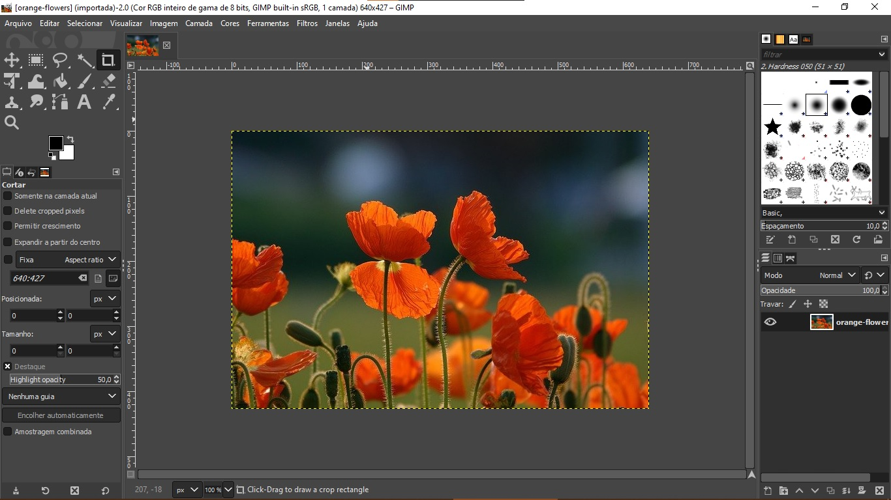
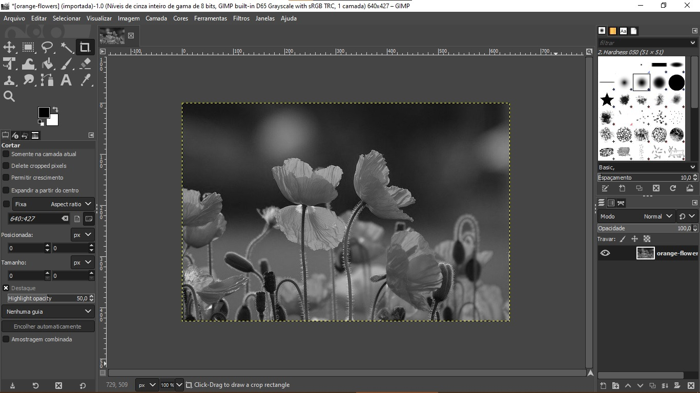
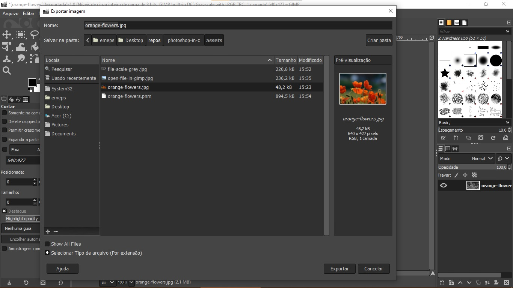
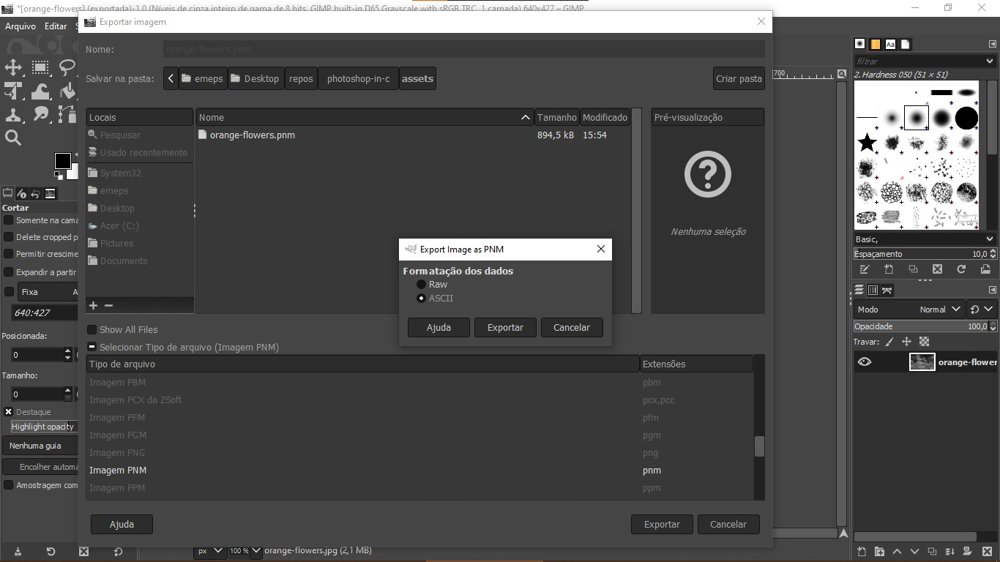

## **Photoshop in C**
O Photoshop in C é uma aplicação contruida para manipular imagem do tipo .pnm, possibilitando a edição da imagem preto e branco. Foi concebido através de um trabalho proposto pelo Professor da disciplina de Programação II ou Programação Estruturada como parte de avaliação da disciplina semestral. 

## **Ferramentas**
Esse projeto foi desenvolvido com as seguintes tecnologias:
- [C](https://docs.microsoft.com/pt-br/cpp/c-language/c-language-reference?view=msvc-160)
- [Git](https://git-scm.com/)
- [VIsual Code Studio](https://code.visualstudio.com/)
- [GCC](https://www.gnu.org/)
  
## **Como usar**
Para utilizar esse aplicativo precisamos ter alguns requisitos:
### **Aplicativos instalados:**
- [GIMP](https://www.gimp.org/) - Editor de imagem. Precisamos dele para exportar as imagens no formato .pnm (ASCII).
- [GCC](https://www.gnu.org/) - Para compilar os arquivos C.
- [Make](https://www.gnu.org/software/make/manual/) - Macro para executar os arquivos C em lote.

### **Gerando imagem pnm.**
Gerando imagem do tipo pnm com GIMP.
Antes de iniciar, certifique que a imagem escolhida para edição seja menor que ***750px por 750px***.
- Primeiro abra o ***GIMP***.
- Vá em ***Arquivo***, depois ***Abrir***.
- Selecione navegue entre as pastas desejadas e encontre o arquivo de imagem desejado.
- Selecione a imagem e clique em ***Abrir***.
- 
- Com a imagem aberta, vá em ***Imagem*** e em seguida vá em ***Modo***.
- Selecione a opção ***Tons de Cinza***.
- 
- Vá em ***Arquivo*** novamente, em seguinda vá até a opção ***Export As...***.
- Clica em ***Selecionar Tipo de Arquivo***. 
- 
- Procure e selecione extensão ***pnm***.
- Clique em ***Exportar***.
- Em seguinda clique em ***ASCII***. 
- 
- Pronto temos o arquivo pnm gerado a partir da imagem selecionada.
- Por final, copie o arquivo de imagem gerado para pasta aonde estão os arquivos fontes para evitar erros.
### **Executando a aplicação.**
Com GNU Compile instalado, vá até a pasta onde os arquivos fontes estão salvos. Abra o ***Terminal*** dentro da pasta. 
Execute o seguinte comando:
```sh
    $ make run
```
Só seguir as instruções na tela. :)
</br>
</br>
</br>
## **FAQ**
### ***Caso não queira utilizar o terminal para executar a aplicação posso utilizar outro software?***
Sim. Pode utilizar outro software para executa como o [CodeBlocks](https://www.codeblocks.org/). Basta abrir um novo projeto dentro do Codeblocks e em seguinda adicionar os arquivos fonte.
### ***Essa aplicação é multiplataforma?***
Sim, para Windows é executado dentro do CodeBlock não é possivel executar somente com o terminal. Mas há um alternativa, basta habilitar subsitemas no Windows e ir na loja da Microsoft e instalar o Ubuntu. Abre o terminar Ubuntu instale todas as dependencias e executa.
No Linux é só instalar o GNU Compiler, Make e derivados. Por fim executar o comando acima.

### ***Não consigo executar o comando acima. O que eu faço?***
Bom se não consegue executar o comando acima é que provavelmente não tem o GNU (gcc) instalado e o as dependencias do Makefile também não esta instalada. </br>
Para instalar o GNU (gcc) no Linux.
```sh
    $ sudo apt-get install gcc
```
Para instalar o Build Essential  no Linux.
```sh
    $ sudo apt-get install build-essential 
```
No Windows é só seguir a sugestão acima, exportar os arquivos para o CodeBlocks.

### ***Mais perguntas entre em contato via email ou aqui mesmo.***